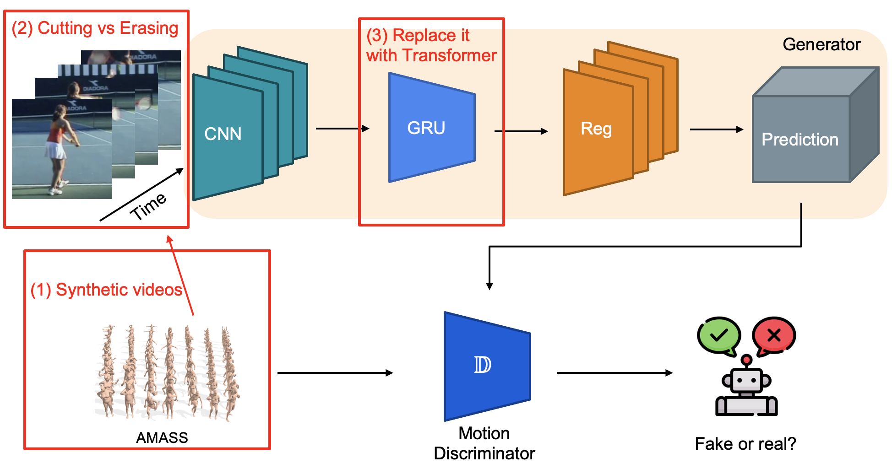

# VIBET:  Enhanced Video Inference of Human Body Pose and Shape Estimation with Transformer

ENGN8501/COMP8539 - Advanced Topics in Computer Vision - Sem 2 2022

Group 01: Qinyu Zhao (u7212335), Ruoyu Wu (u7268194), Zitian Zhou (u7367877)

Abstract:

In this project, we reproduce a paper titled ``**VIBE: Video Inference for Human Body Pose and Shape Estimation**", authored by Muhammed Kocabas (Max Planck Institute for Intelligent Systems) et al, and published in IEEE CVPR 2020. The paper proposes a model called VIBE which exploits adversarial learning to estimate the pose and shape of a human body in a video. In our project, the original model and experiments are reproduced and an enhanced model, VIBET, is proposed. Three improvements are implemented, including (1) boosting the model using synthetic data, (2) using and comparing cutting and erasing to enhance data, and (3) replacing Gated Recurrent Units (GRU) with Transformer. The experimental results show that VIBET outperformed VIBE on two benchmark datasets.



<center>Figure 1. The framework of the VIBE model. The red parts are our improvements.</center>

## What We Did

| Folder         | File                     | Remark                                                       |
| -------------- | ------------------------ | ------------------------------------------------------------ |
| core           | config.py                | Modified to cover more experiments and datasets.             |
|                | function.py              | Rewritten as practice to reproduce the paper.                |
|                | loss.py                  | We didn't change but added some comments.                    |
| data_aug       | augment_utils.py         | Written by us. <br/>For implementing the random mask, we referred to <br/>Zhong, Zhun, et al. "Random erasing data augmentation." Proceedings of the AAAI conference on artificial intelligence. Vol. 34. No. 07. 2020. |
|                | penn_action_aug.py       | Modified from data_utils/penn_action_utils.py, which was used to augment the PennAction dataset. |
|                | threedpw_aug.py          | Modified from data_utils/threedpw_utils.py, which was used to augment the 3DPW dataset. |
| data_synthesis | amass_read_1by1.py       | Modified from data_utils/amass_utils.py, which was used to extract sequence from AMASS per subject. |
|                | syn_videos_process.py    | Modified from data_utils/penn_action_utils.py, which was used to preprocess the synthetic dataset. |
|                | synthesis_pipeline       | Modified from SURREAL https://github.com/gulvarol/surreal. You need to copy the files into the orignal repo to run them. |
| data_utils     | h36m_utils.py            | Modified from data_utils/threedpw_utils.py, which was used to preprocess the Human3.6 dataset. |
|                | mpii3d_utils_per_sub.py  | The orignal dataset is too big and will cause memory error on our cloud service. We have to use this script to extract them per subject. |
|                | Other files              | We didn't change but added some comments.                    |
| dataset        | h36m.py                  | Modified from other classes, which was used to leverage the Human3.6M dataset. |
|                | XXX_cut.py, XXX_erase.py | The classes modified from other dataset classes, which are used to leverage the augmented datasets. |
|                | syn_videos.py            | Modified from other classes, which was used to leverage the synthetic dataset. |
|                | Other files              | We didn't change but added some comments.                    |
| model          | discriminator.py         | Rewritten as practice to reproduce the paper.                |
|                | vibe.py                  | Rewritten as practice to reproduce the paper.                |
|                | selfAttention.py         | Rewritten as practice to reproduce the paper.                |
|                | vibet.py                 | Written by us.<br />Refs: https://machinelearningmastery.com/a-gentle-introduction-to-positional-encoding-in-transformer-models-part-1/<br />https://pytorch.org/docs/stable/generated/torch.nn.TransformerEncoderLayer.html<br />https://pytorch.org/docs/stable/generated/torch.nn.TransformerEncoder.html<br />Shan, Wenkang, et al. "P-STMO: Pre-Trained Spatial Temporal Many-to-One Model for 3D Human Pose Estimation." arXiv preprint arXiv:2203.07628 (2022). |
| Other          |                          | We didn't change but added some comments.                    |

## Get Started

VIBE has been implemented and tested on Ubuntu 18.04 with python >= 3.7. It supports both GPU and CPU inference.

Install the requirements using `virtualenv` or `conda`:
```bash
# pip
source scripts/install_pip.sh

# conda
source scripts/install_conda.sh
```

We uploaded the synthetic videos onto Google Drive. You can download them from [here](https://drive.google.com/drive/folders/1iawJEEMreBQJe92UdGlMk4ZNxoN68Ey_?usp=sharing).

## Training

Run the commands below to start training:

```shell script
source scripts/prepare_training_data.sh
python train.py --cfg experiments/transformer/train_with_tf_8H_2L.yaml
```

Note that the training datasets should be downloaded and prepared before running data processing script.
Please see [`doc/train.md`](doc/train.md) for details on how to prepare them. 

We also uploaded the processed dataset onto Google Drive. You can download them by clicking [here](https://drive.google.com/drive/folders/1Fl2mv0XClmNJlayCIN4tFMgx_9p3_IKC?usp=sharing). After that, please put the vibe_db folder under the data folder. Your directory tree should look like this:

```
${VIBET_ROOT}
|-- data
|   |-- vibe_db
|   |-- vibe_data
|   `-- ...
`-- ......
```

## Evaluation

Run the commands below to start evaluation:

```shell script
python eval.py --cfg experiments/transformer/eval_with_tf_8H_2L.yaml
```

We uploaded the model checkpoints and training log files onto Google Drive. To repeat our experimental results, please download them from [here](https://drive.google.com/drive/folders/1T0DMa-i_WsH9N78ZYZ-v5p8bfzjDA0Tr?usp=sharing), and put the result folder under the root folder. Your directory tree should look like this:

```
${VIBET_ROOT}
|-- doc
|-- experiments
|-- lib
|-- scripts
|-- results
`-- ......
```

## Run Scripts

We provided some scripts to quickly re-run our experiments. Run the following commands

```
bash ./scripts/run_experiments_reproduce.sh
bash ./scripts/run_experiments_tf.sh
bash ./scripts/run_experiments_aug.sh
```

## License
This code is available for **non-commercial scientific research purposes** as defined in the [LICENSE file](LICENSE). By downloading and using this code you agree to the terms in the [LICENSE](LICENSE). Third-party datasets and software are subject to their respective licenses.


## References
We indicate if a function or script is borrowed externally inside each file. Here are some great resources we 
benefit:

- Pretrained HMR and some functions are borrowed from [SPIN](https://github.com/nkolot/SPIN).
- SMPL models and layer is from [SMPL-X model](https://github.com/vchoutas/smplx).
- Some functions are borrowed from [Temporal HMR](https://github.com/akanazawa/human_dynamics).
- Some functions are borrowed from [HMR-pytorch](https://github.com/MandyMo/pytorch_HMR).
- Some functions are borrowed from [Kornia](https://github.com/kornia/kornia).
- Pose tracker is from [STAF](https://github.com/soulslicer/openpose/tree/staf).
- The official repository of [VIBE](https://github.com/mkocabas/VIBE)

